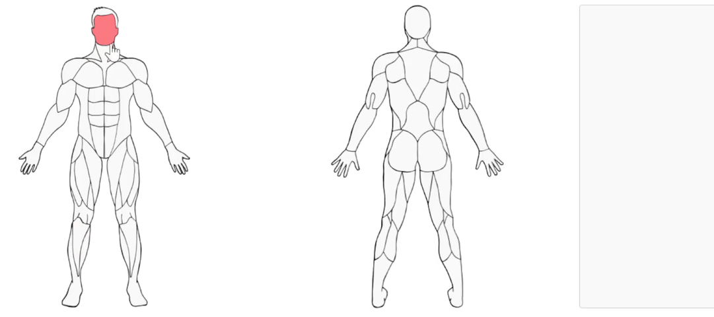

# SVG Path Highlighter

A library to highlight SVG paths based on user interactions, making them interactive.



## Table of Contents

- [Usage](#usage)
- [Configuration](#configuration)
- [API](#api)
- [Examples](#examples)
- [Development](#development)
- [License](#license)

## Usage

### JavaScript

First, import the library and initialize it with a container and configuration:

```js
// index.js
import SVGPathHighlighter from "svg-path-highlighter";
import config from "./path/to/config.json";

const container = document.getElementById("svg-container");
const highlighter = new SVGPathHighlighter(container, config);

highlighter.init();
```

### HTML

Ensure you have a container in your HTML to hold the SVG:

```html
<!-- index.html -->
<div id="svg-container"></div>
```

## Using Built-in Configurations

You can also use the built-in configurations for human body front and back views. Use the `loadConfig` method to load these configurations:

```js
import SVGPathHighlighter from "svg-path-highlighter";
import { loadConfig } from "svg-path-highlighter/configLoader";

const container = document.getElementById("svg-container");

loadConfig("HumanBodyFront").then(config => {
	const highlighter = new SVGPathHighlighter(container, config);
});
```

Available configurations:

- HumanBodyFront
- HumanBodyBack

## Grouping SVG Paths

You can pass a third option in the constructor for grouping the SVG paths (optional). When hovered, the parts in the array will be hovered and selected together.

Example group object:

```js
const groupConfig = {
	group1: ["part1", "part2", "part3"],
};

const highlighter = new SVGPathHighlighter(container, config, groupConfig);
```

## Configuration

The configuration object should follow the `SVGHighlighterConfig` interface:

```ts
interface SVGHighlighterConfig {
	image: {
		id: string;
		width: number;
		height: number;
		href: string;
		transform: string;
	};
	paths: Array<{
		id: string;
		path: string;
	}>;
}
```

### Example Configuration

```json
{
	"image": {
		"id": "body-front",
		"width": 100,
		"height": 200,
		"href": "data:image/png;base64,front",
		"transform": ""
	},
	"paths": [
		{ "id": "front-part1", "path": "M10 10 H 90 V 90 H 10 Z" },
		{ "id": "front-part2", "path": "M20 20 H 80 V 80 H 20 Z" }
	]
}
```

## API

### Methods

- **`getConfig()`**: Returns the current configuration.
- **`getSelectedPaths()`**: Returns an array of selected path IDs.
- **`setSelectedPaths(paths: string[])`**: Sets the selected paths by their IDs.
- **`validateGroupConfig()`**: Validates the group configuration.
- **`destroy()`**: Cleans up and removes event listeners.

### Example

```js
const highlighter = new SVGPathHighlighter(container, config);

// Get the current configuration
const currentConfig = highlighter.getConfig();

// Get selected paths
const selectedPaths = highlighter.getSelectedPaths();

// Set selected paths
highlighter.setSelectedPaths(["front-part1", "front-part2"]);

// Validate group configuration
highlighter.validateGroupConfig();

// Destroy the highlighter
highlighter.destroy();
```

## Examples

### Vue.js Example

You can find a complete example using Vue.js in the `examples/vue` directory.

#### Project Setup

```bash
cd examples/vue
npm install
```

#### Compile and Hot-Reload for Development

```bash
npm run dev
```

#### Compile and Minify for Production

```bash
npm run build
```

## Development

### Running Tests

To run the tests, use the following command:

```bash
npm test
```

### Building the Project

To build the project, use the following command:

```bash
npm run build
```

## License

This project is licensed under the MIT License. See the LICENSE file for details.
